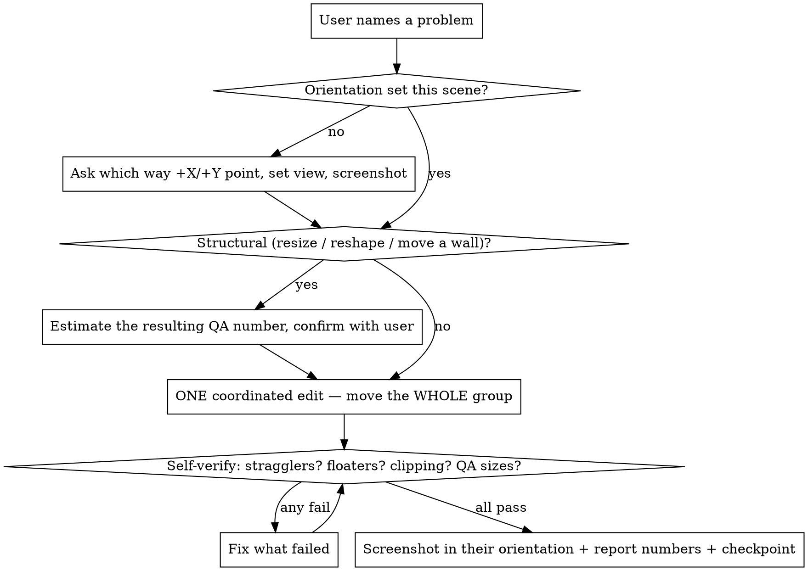

# BVB Refine Loop

Drive the **human-led** refinement of ONE existing BVB scene via BlenderMCP. The user
compares the source video against Blender and decides what is wrong; you ask, edit, and
verify. Mechanical setup is the `refine/bvbrefine.py` CLI. Reusable Blender snippets are in
`blender-mcp-recipes.md` — read it before editing geometry.

## Interaction protocol (this is the point — don't skip it)

The user looks at the video; you don't see what they see. So:

1. **Follow the user's lead on who drives diagnosis.** Default: the user names the problem.
   But some users will ask *you* to propose your read first, then discuss high-level before
   executing — do that when asked. Either way your read is a *hypothesis to verify*, not a
   fact. (We once "knew" a bedroom had one spurious bed — it had two real beds.)
2. **Ask before structural edits.** Show *measured* geometry (bounding boxes, the slope line,
   the floor footprint) and confirm direction/amount before moving walls or deleting groups.
3. **For deletions, list candidates with reasons and let the user veto specific items**
   before removing anything.
4. **Split a batch of instructions into "do-now" vs "flag-first."** When the user dumps
   several edits at once, execute the unambiguous ones, but STOP and flag anything that
   changes what a QA test measures — especially **renaming/reclassifying an object** (e.g.
   "this is a water heater, not a washer"). Renaming can orphan the QA's named object; check
   whether a test still has its target before you proceed (see Heuristics).
5. **Hiding / isolating ≠ deleting.** Say so every time, or the user thinks you wiped the
   scene. Prefer wireframe over hiding.
6. **One coordinated edit → SELF-VERIFY → screenshot → checkpoint** (see "The edit loop"
   below — never hand back on a bare `execute_blender_code` success).

## The edit loop — an edit is DONE when VERIFIED, not when the geometry moved

The single biggest failure mode is treating "`execute_blender_code` succeeded" as "edit done."
A successful call only means Blender ran the code — not that the scene is right. Every round
runs the loop below; **do not hand back until step 3 passes.**

**0 — Orientation handshake (once per scene, ASK — don't infer).** The user's 2D-plan axes
**flip per scene** (47332005 was X-left/Y-down; 41125760 was X-right/Y-up). Before the first
structural edit, ask: *"In your plan, which way is +X and +Y — left/right, up/down?"* Set the
viewport quaternion so screen = their plan, and screenshot to confirm you both see the same
thing. Guessing left/right from world axes is the #1 time-sink in this work.

**1 — Estimate BEFORE a structural edit, then confirm.** Before you resize/reshape/move a wall,
**compute the resulting QA number** (the object's `longest_dimension`, the room bbox X·Y, or the
`closest_distance`), compare it to GT ± tolerance, and ask the user *"this makes <thing> = <N>,
reasonable?"* BEFORE editing. Sizes are pinned by the QA — a 165 cm tub needs a 1.65 m alcove;
if the walls don't fit it, the **room** is mis-sized, not the tub. Reshape-then-discover-the-
QA-broke is the slow path; the user can't see your numbers unless you state them.

**2 — Move the WHOLE group.** Moving an object means its body **+ every sub-part** (seat / lid /
tank / faucet / handle / flush-plate) **+ its trim** (baseboard, mosaic border) **+ accessories
that sit on or beside it** (soap / towel / TP / scale). Build the name list explicitly *before*
moving. A forgotten part stays stranded where the object used to be — that is most "floating"
objects and most out-of-room strays.

**3 — SELF-VERIFY (you MUST create a TodoWrite item per line and complete them in order):**
   1. **Stragglers** — scan every mesh: is any center outside the room (bathroom ∪ hallway
      bounds)? Is any wall-mounted item now detached from its wall (an X/Y gap)? Re-seat it.
   2. **Floaters (悬空)** — scan `z_min`: anything off the floor (`z_min > 0.1`) that is NOT
      against a wall AND NOT resting on a surface (vanity top / cistern / tub rim)? Drop or seat
      it. (A toilet seat at z=0.65 is too high; ~0.4 m is right.)
   3. **穿模 (clipping)** — do the moved objects' bboxes overlap each other, or poke past a
      wall's inner face? Separate them.
   4. **QA sizes** — re-measure every quantity the edit could touch (longest_dimension, room
      bbox, closest_distance) vs GT ± tol, or run `bvbrefine gate`. `actual=None` = grounding
      failed, not a wrong scene.

   The reusable straggler+floater+clipping scan is in `blender-mcp-recipes.md` (`self_verify`).
   "I moved it" is **not** a hand-back. "I moved it, scanned stragglers/floaters/clipping,
   re-measured the QA → here are the numbers" is.

## Loop

1. `python refine/bvbrefine.py start <id>` — prints QA + focus hints + the scene's unit
   tests, extracts reference frames to `blend/refine_<id>/frames/`. Read the frames. Save a
   `v00_baseline` snapshot via MCP (`save_as_mainfile(..., copy=True)`).
2. Wait for the user to state a problem. Ask clarifying questions. Edit one group at a time
   (recipes file), `get_viewport_screenshot` to verify, then snapshot `<id>_vNN_<desc>.blend`.
3. `python refine/bvbrefine.py gate <id>` — offline-deterministic `function` tests (room_area
   etc.); add `--judge` (needs `OPENAI_API_KEY` + `BVB_JUDGE_MODEL`) for `proposition` tests
   (route_planning).
4. On the user's approval: `save_mainfile()` to write `blend/<id>.blend`, then their git flow
   (e.g. a personal branch + a scene-only PR of just the `.blend` to main).

## Verification

- `function` tests: compute the quantity live in Blender for instant feedback, then
  `bvbrefine gate` re-scores offline. It auto-grounds **`room_area`** (floor bbox X·Y),
  **`longest_dimension`** (object_size — matches `object_ref`, picking the LARGEST matching
  group so it grabs the body not a sub-part), and **`closest_distance`** (two objects from
  `params.object_refs`). Only `count_objects` still needs `--judge`. A `function` test that
  prints `actual=None` means grounding failed, NOT that the scene is wrong.
- **`closest_distance` (object_abs_distance) grounds EACH ref to its single LARGEST sub-part by
  longest bbox edge, then scores the 3-D gap between those two bboxes — built from
  `location ± obj.scale/2`, NOT mesh/matrix_world.** Gotcha that burned a whole session: a
  backrest spanning the body's full width can tie/beat the seat and BECOME the grounded "sofa",
  so the gap is measured from whatever part is largest — and if that part is the one nearest the
  other object, the distance collapses. Make the part you intend unambiguously the longest, keep
  the whole object's near edge far enough, and replicate the grounding (or run `gate`) — never
  trust a matrix_world hand-measure (it disagreed with the gate by ±0.5 m repeatedly).
- **Size tests measure `obj.scale`, so a size-QA object MUST be a scaled cube.** The harness
  `object_extent` reads each object's `scale`, not its mesh bbox — a complex/cylinder mesh (or
  a cube with applied scale that exports without scale) reads as **1.0 m** and the test prints
  `actual=100`. If an object the QA measures isn't a `primitive_cube_add(size=1)` + `obj.scale`,
  rebuild it from scaled cubes at the target size (this is also the "primitives only" rule).
- `proposition` tests (route_planning): reason from geometry + frames; `--judge` for official.

## Common problems → quick fix (all snippets in `blender-mcp-recipes.md`)

| Symptom | Fix |
|---|---|
| Top view snaps back to perspective | set `region_3d.view_rotation` quaternion + `view_perspective='ORTHO'` |
| Sloped ceiling blocks the top view | wireframe shading (preferred), or hide ceiling + restore — **tell the user** |
| bbox / `matrix_world` reads the old value after a move | `bpy.context.view_layer.update()` before reading |
| Multi-part object (wardrobe) drifts when scaled/rotated | transform the whole group about the 3D cursor at its bbox center |
| A wall can't follow the sloped ceiling | rebuild it as a pentagon prism via bmesh (`z(y)` from the ceiling verts) |
| Floating outlets / bed feet / a door behind the bed | stray-object scan → confirm → delete |
| Baseboard / crown left behind after moving a wall | move/trim the trim with its wall (separate objects!) |
| Need a doorway in a wall | split the wall into two segments (no booleans) |
| Room too small/narrow — widen but keep one wall fixed | anchored axis-scale (cursor at the fixed wall, resize on that axis); then move the opposite wall + its furniture group |
| Appliance should be wall-mounted / under-counter | translate the part group in Z (mount) or place under the counter; counter/cabinet extend to it |
| `object_size` gate prints `actual=100` (or ~1 m) | the object is a complex/cylinder mesh — rebuild it from `primitive_cube_add(size=1)` + `obj.scale` at the target size |
| QA needs a whole missing room (combined space) | analyze the video first (Workflow over many frames), then build the second room south of the existing one through the door |
| Distance QA wildly off vs your hand-measure | gate grounds 'sofa'/'toilet' to the LARGEST sub-part (a full-width back can outrank the seat) + uses `location±scale/2` — replicate the grounding, don't measure `matrix_world` |
| Side/perpendicular walls gap after you deepen/reshape the floor | moving the Floor + back wall doesn't drag the side walls — extend every wall that meets the moved one |
| Living room "feels small" but room_area is at its cap | shrink the FURNITURE (sofa), not the walls — room_area is the floor bbox, hard-capped at GT±tol |
| Orphaned door/object floating from an old layout | after any reshape, scan for objects not inside a wall + walls that don't connect; move into a wall or delete |

## Checkpoint convention

`blend/refine_<id>/` (git-ignored). Names `<id>_vNN_<desc>.blend`, `v00_baseline` first.
Always `save_as_mainfile(..., copy=True)` so the live `blend/<id>.blend` is untouched until
final approval. Roll back by opening any `vNN`.

## Heuristics (append one line per scene as you learn them)

- Two beds can BOTH be real — verify against the video; don't assume one is a hallucination.
- Attic room: side walls should be pentagons whose top follows the sloped ceiling; trim the
  crown molding to the flat-top section so it doesn't float over the slope.
- A window in a sloped ceiling is a skylight, not a vertical-wall window.
- "Wardrobe with two mirrors" → two distinct mirror panels on the door that **faces the room**
  (rotate the wardrobe so its mirrored face points inward, then re-seat it against the wall).
- room_size too large → resize the Floor and shift the back wall toward the beds by the same
  Δy (recipe), hitting the target area; confirm with `gate`. Floor bbox X·Y is what's scored.
- room_area scores ONE floor's bbox X·Y — so a multi-room / "combined space" needs a SINGLE
  rectangular Floor whose bbox = the target area (two separate floors or an L-shape fail: the
  bbox is one floor or the L's outer rectangle). When the same scene also fixes a distance
  (e.g. sofa↔toilet 3.9 m), the area + distance constraints can force the proportions (we got
  a long 2×7.8 m rectangle); flag that trade-off to the user rather than guessing.
- "Combined space" QA but only one room modeled → the other room is through the door; build it
  south of the existing room (door wall becomes the shared partition, cut its opening), and
  analyze the video with a Workflow first since you can't see it.
- An indented ("凹进") corner = remove the floor there and wall off the adjacent room edge;
  the leftover region reads as outside.
- Never infer left/right/front/back from world axes — anchor to the video viewpoint first
  (doorways, sight lines). Don't add doors/openings not seen in the video.
- Reclassifying an object can orphan a QA target: when the user says the wall box is a water
  heater (not a washer), the "washer" object_size + route tests lose their object. Add the
  real appliance the QA names (e.g. a front-load washer under the counter, sized to the GT)
  AND keep the reclassified one. Name it so the judge finds it (`Washer_Body`).
- Galley / utility room too narrow: widen by anchored X-scale of the floor + back/front
  walls (cursor at the fixed wall), move the opposite wall out, and shift the counter +
  cabinets + sink + appliances as one group to sit against that wall, clear of the doors.
- Match appliances to the video: under-counter front-load washer (round door facing the
  room), wall-mounted water heater near the ceiling; a "table" with a solid base, not legs.
- A fixed object_abs_distance + a wall choice can over-constrain: putting the object on the wall
  that minimizes the X-gap to its pair forces ALL the distance onto the other axis, jamming the
  far object to the far end with no room left. Compute the budget early (dx from the wall →
  required dy) and flag the trade-off BEFORE iterating; the user may pick video-faithfulness
  over the distance QA ("不改了，就这样吧"). Moving the toilet "up" can directly fight a sofa↔toilet
  distance — say so, don't silently thrash.
- Furniture sub-parts: the user specifies relations precisely ("chaise at the body's upper-LEFT,
  X within the body — no stick-out", "back on the body's +Y/down edge" — the back's edge sets
  the facing). Edit one relation, verify with measured bboxes, screenshot; watch for sub-part
  穿模 (overlap) and re-check the distance gate after every sofa move (the grounded part shifts).
- "Make the room bigger" when room_area is already near its cap → shrink the furniture so the
  space reads open; growing walls fails room_area (floor bbox, GT±tol).
- A room that's "too deep/wide for the fixture" is a ROOM-size error, not a fixture error: a
  165 cm tub that should touch both end walls needs a ~1.65 m-deep alcove; if the room is 2.7 m,
  shrink THAT dimension (anchored scale at the fixed wall) and lengthen the connected room (the
  hallway) so the COMBINED area stays in GT±tol. The gate's bbox metric can't sum two floors,
  but the real combined area must land in band — say so and don't chase the red room_size number.
- toilet `object_size` → 80 cm via a tall **back-to-wall cistern**: a `primitive_cube_add(size=1)`
  + `obj.scale=(0.38,0.2,0.8)` whose longest edge is its HEIGHT (~0.8 m). It becomes the grounded
  "toilet" for BOTH the size test AND `closest_distance`, so position the CISTERN (not just the
  bowl) for the distance, and drop the bowl so the seat sits ~0.4 m (not floating at 0.65).
- After ANY anchored wall scale, run BOTH scans: out-of-room (center outside bounds) AND floaters
  (`z_min` off-floor, not against a wall, not on a surface). A shell scale moves walls/floor but
  NOT the excluded fixtures, so wall-mounted fixtures detach (gaps) and loose accessories strand.

## Delivery (git) — keep tooling personal, ship only the .blend

- Work on a personal branch (`andy`); the `refine/` tooling, skill, docs, and checkpoints
  live there and never go to `main`.
- Stay current: `git fetch origin` then `git merge origin/main` into your branch periodically
  (teammates push scenes + export-script fixes to main).
- Ship a scene: branch clean off `origin/main`, take ONLY the one file, push to main:
  `git checkout -b deliver-<id> origin/main` → `git checkout <yourbranch> -- blend/<id>.blend`
  → commit `Refine Blender Scene <id>` → push `deliver-<id>:main` → delete the temp branch.
- SSH (port 22) may time out here; prefix fetch/push with the gh credential helper:
  `git -c url."https://github.com/".insteadOf="git@github.com:" -c credential.helper='!gh auth git-credential' <fetch|push> …`
- After the push lands, the user updates the Notion tracker row: `Refiner` = their name,
  `Spatial` = `Done` (those two columns only).
