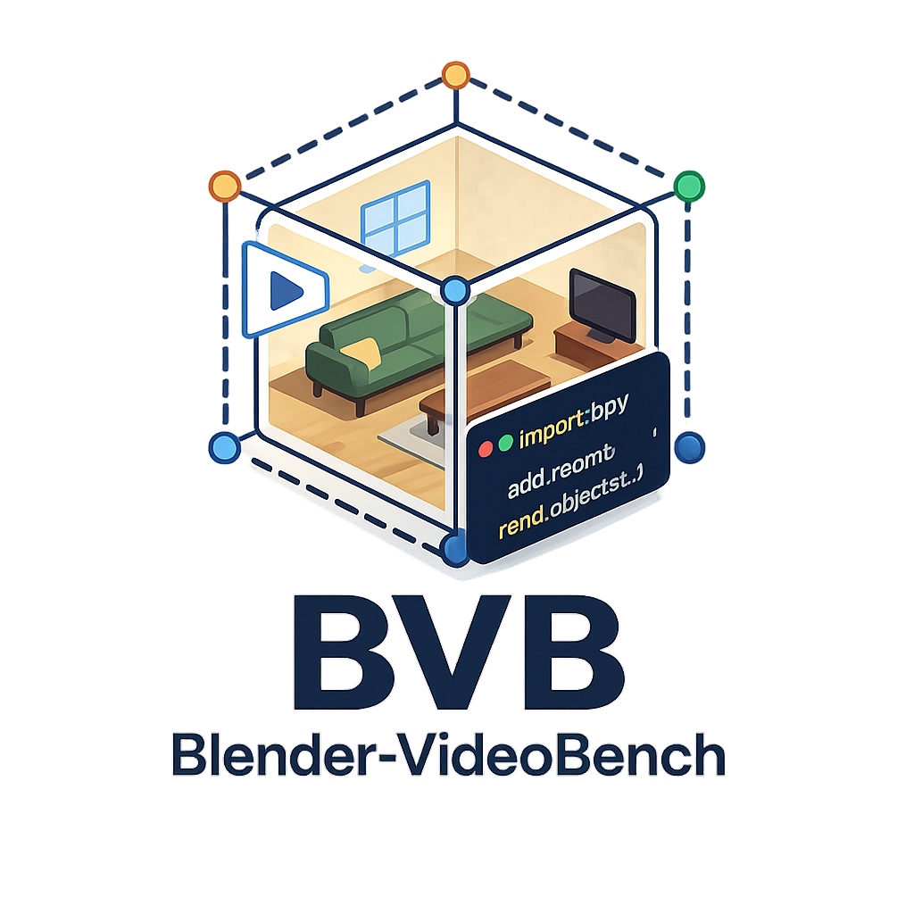
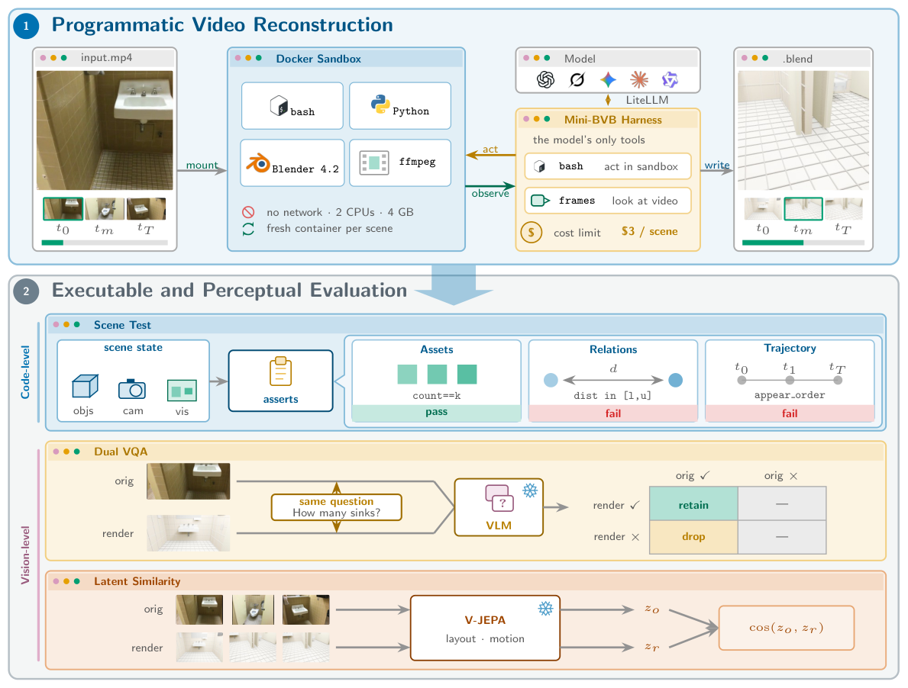

<p align="center">
  
</p>

<h1 align="center">BVB: Blender-VideoBench</h1>

<p align="center">
  <strong>BVB: Benchmarking Agentic Video Understanding via Programmatic Reconstruction in Blender</strong>
</p>

<p align="center">
  <a href="https://yoloytang.me/BVB/"></a>
  <a href="LICENSE"></a>
</p>

> **If an agent truly understands a video, it can reconstruct it programmatically.**

We introduce **BVB**, Blender-VideoBench, a benchmark that tests this ability
by asking agents to reconstruct real-world videos as animated Blender scenes.
To ensure fair comparison, each agent programs the reconstruction through a
lightweight harness, **Mini-BVB**, in an identical sandbox under a shared cost
limit. External asset libraries are disallowed.

<p align="center">
  <a href="https://yoloytang.me/BVB/">
    
  </a>
</p>

## At a glance

- **288 real indoor videos** from the held-out VSI-Bench test split, sourced
  from ARKitScenes, ScanNet, and ScanNet++.
- **5,130 spatiotemporal questions**, shared across all reconstructions.
- **47 agent configurations across nine model families**, evaluated under one
  shared sandbox and prompt contract.
- **Two complementary axes**: paired video-QA retention and frozen
  video-embedding similarity.
- **No external asset libraries**. Agents construct geometry from Blender
  primitives and operators instead of retrieving meshes.
- **Animated, executable output**. The target is a Blender program and scene,
  not a caption, a single image, or a static snapshot.

The full interactive results are on the
[project page](https://yoloytang.me/BVB/#leaderboard). A
[CSV snapshot of all 47 configurations](assets/bvb-results.csv) is also included
in this repository. This README focuses on the benchmark and reproducible workflow.

## Why programmatic reconstruction?

Question answering measures what a model can say about a video.
Programmatic reconstruction asks it to create a persistent world that can be
reopened, edited, animated, and rendered.

- **Vision is raw.** Pixels do not explicitly state which scene generated them.
- **Language is ambiguous.** Many incompatible scenes fit the same description.
- **Code creates a native artifact.** It can be executed, inspected, revised,
  and rendered from new viewpoints.

## Benchmark protocol

<p align="center">
  
</p>

1. **Reconstruct.** A cost-limited agent receives only `bash` and `frames`
   inside a fresh Blender 4.2 Docker sandbox. It inspects the source video and
   writes an animated `result.blend`.
2. **Evaluate.** Scoring is fully decoupled from the agent loop. The submission
   is rendered for paired video QA and encoded by a frozen video model.

### Evaluation axes

| Axis | Signal | What it checks |
|---|---|---|
| **Dual VQA (DV)** | Original-correct answer retention | Whether the reconstruction preserves question-answerable content from the source video |
| **Latent Similarity (LS)** | Frozen V-JEPA 2.1 similarity | Layout and motion agreement between the source clip and rendered reconstruction |

Both axes are expressed on a 0–100 scale. Overall is their square-root mean:

$$
\mathrm{Overall} = \left(\frac{\sqrt{\mathrm{DV}} + \sqrt{\mathrm{LS}}}{2}\right)^2.
$$

More uneven performance receives a larger penalty. Failed reconstructions
remain in the evaluation pool and score zero on both axes.

## What current agents reveal

- **GPT-6 Astra high** leads the 47-configuration pool with **53.7 DV**,
  **88.6 LS**, and **70.07 Overall**.
- **GPT-5.6 Sol xhigh** follows at 67.49 Overall, then **Grok-4.6 xhigh** at
  **67.17** and **Claude Opus 5 high** at 66.21.
- A blind study with **15 raters** agrees strongly with LS at the scene-model
  level (Spearman ρ = 0.83). Overall matches the human ordering of the five
  tested configurations (ρ = 1.00); Astra was not included in that study.
- Even Astra loses nearly half of the spatial questions that are answerable
  from the original videos.

## Run the benchmark

### 1. Prepare the source videos

BVB uses the real indoor clips from
[VSI-Bench](https://vision-x-nyu.github.io/thinking-in-space.github.io/).
The source videos are not redistributed in this repository. Download them
from the upstream dataset and arrange them as:

```text
VSI-Bench/
  arkitscenes/<scene_id>.mp4
  scannet/<scene_id>.mp4
  scannetpp/<scene_id>.mp4
```

The tracked [`eval/test.jsonl`](eval/test.jsonl) supplies the benchmark's 288
scenes and 5,130 questions. Use that metadata to reproduce BVB rather than
substituting a different upstream split.

### 2. Build the Stage-1 sandbox

Prerequisites are Python 3.10+, Docker, and `ffmpeg`/`ffprobe`. Run the commands
below from the repository root; the first command enters `sandbox/`. Stage-2
rendering also requires a host Blender installation, and LS encoding requires
a GPU environment.

```bash
cd sandbox
docker build -t bvb-sandbox:latest .
python3 -m venv .venv
.venv/bin/pip install -r requirements.txt
```

### 3. Reconstruct a smoke-test subset

```bash
export OPENAI_API_KEY="..."  # or the key required by your provider

.venv/bin/python run_agent.py \
  --model gpt-6-astra \
  --reasoning high \
  --output results/run_001 \
  --cost-limit 3.0 \
  --limit 5
```

Remove `--limit` to run all 288 scenes. Use `--resume` for interruption-safe
batches. See [`sandbox/README.md`](sandbox/README.md) for the full harness
contract and provider options.

### 4. Render and evaluate the reconstructions

```bash
.venv/bin/python ../eval/batch_render_camera.py \
  --run results/run_001 \
  --num-frames 64 \
  --resume
```

This command creates the camera renders; it does not compute scores. If Blender
is not on `PATH`, set `BLENDER_BIN` to its executable. Follow
[`eval/README.md`](eval/README.md) to score Dual VQA with the judge API and LS
with the frozen V-JEPA encoder, then combine the two axes.

## Restore released run artifacts

Run these download commands from the repository root. Large Stage-1 artifacts
are kept outside GitHub in the Hugging Face dataset
repository `yunlong10/BVB-results`. Access is required.

```bash
python3 -m pip install huggingface_hub hf_transfer
hf auth login
HF_HUB_ENABLE_HF_TRANSFER=1 python scripts/download_results.py
```

To restore one run:

```bash
HF_HUB_ENABLE_HF_TRANSFER=1 python scripts/download_results.py \
  --run mini-harness-gpt-5.6-sol-reasoning-high-run01
```

## Repository guide

- [`sandbox/`](sandbox/README.md): Stage-1 agent harness and Blender Docker sandbox.
- [`eval/`](eval/README.md): Dual VQA and V-JEPA evaluation.
- [`blend/`](blend/): human-refined Blender reference scenes.
- [`addons/`](addons/README.md): optional Blender-to-Python exporter for legacy workflows.
- [`refinement_guidance.md`](refinement_guidance.md): scene-refinement workflow.

Historical Python exports and retired illustrations remain available in Git
history. Local archival copies under `_archive/` are excluded from Git.

## Contributing

Reference-scene refinement is still active. Please read
[`refinement_guidance.md`](refinement_guidance.md) before claiming a scene.
Cursor users can also follow the repository's BVB scene-builder skill at
`.cursor/skills/bvb-scene-builder/SKILL.md`.

## Citation

```bibtex
@misc{tang2026bvb,
  title = {BVB: Benchmarking Agentic Video Understanding via Programmatic Reconstruction in Blender},
  author = {Yolo Y. Tang and Daiki Shimada and Jiayue Meng and Jing Bi and Pinxin Liu and Yicheng Wang and Yunzhong Xiao and Zhangyun Tan and Zeliang Zhang and Chao Huang and Susan Liang and Qianxiang Shen and Luchuan Song and Ali Vosoughi and Mingqian Feng and Melika Filvantorkaman and Chenliang Xu},
  year = {2026},
  url = {https://yoloytang.me/BVB/}
}
```

## License

BVB is released under the [MIT License](LICENSE).
