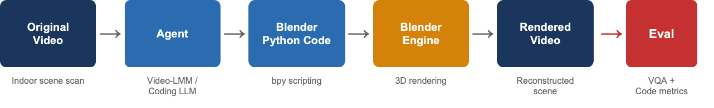
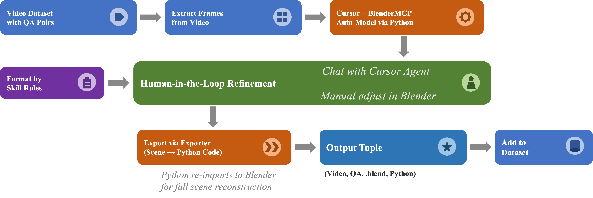

# BVB: Benchmarking Video Agents with Programmatic Reconstruction
<p align="center">
  
</p>

**BVB** is a benchmark for evaluating fine-grained video understanding through programmatic reconstruction. Instead of relying solely on QA accuracy, which is a necessary but insufficient measure of understanding, BVB asks an agent to generate executable code that reconstructs the content and events depicted in a video — both its spatial layout and temporal dynamics. Because code is precise, structured, executable, and verifiable, a successful reconstruction provides a *computational proof* of understanding.

This repository hosts the dataset and refinement tooling for BVB.

> Please join our [Discord server](https://discord.gg/n86Zycpz)!

> *If an agent truly understands a video, it can reconstruct it programmatically.*

## Motivation

Existing video LLMs are typically evaluated on multiple choice or open ended QA. But QA accuracy can mask shallow understanding: a model might pick the right answer for the wrong reason, or memorize dataset biases. BVB takes a fundamentally different view of evaluation:

- **Vision** is raw and unstructured.
- **Language** is descriptive but ambiguous.
- **Code** is precise, structured, executable, and *verifiable*.

If an agent can write a program that, when executed, reconstructs the video's content on the relevant spatial and temporal properties, that is much stronger evidence of understanding than picking option (C) on a multiple choice question.

## Pipeline



The benchmark supports two complementary uses:

1. **Evaluation** *(near-term focus)*: measure how well video agents reconstruct video content as executable programs (e.g., BlenderMCP-style systems and future methods).
2. **Enhancement** *(medium-term direction)*: use code execution feedback (executes? renders correctly? preserves QA-relevant info?) as a reward signal for RL training (e.g., GRPO).

## Execution backend

We use Blender as the default execution and rendering backend: it provides modeling, animation, rendering, and simulation through a full Python API under a permissive open source license. The benchmark target is programmatic reconstruction of video content, not Blender expertise per se.

## Data

The source videos come from **VSI-Bench** ([Visual Spatial Intelligence Benchmark](https://vision-x-nyu.github.io/thinking-in-space.github.io/)), real indoor videos from ArkitScenes, ScanNet, and ScanNet++ with spatial reasoning QA pairs. VSI-Bench is not committed to this repo and should be cloned locally.

Each finished BVB data point is a tuple of:

- the original video (from VSI-Bench)
- the spatial reasoning QA pairs
- the human submission `.blend` scene
- (eventually) the exported Python script that reconstructs the scene

The data pipeline combines automated reconstruction with human in the loop refinement:



1. Take a VSI-Bench video and its QA pairs.
2. Extract representative frames.
3. Use an agent (Cursor + [BlenderMCP](https://github.com/ahujasid/blender-mcp)) to auto build a first pass Blender scene.
4. A human uses Blender to produce a stronger scene-code submission for the same video. This submission is evaluated by the same tests as any agent output.
5. Export the scene to Python via the custom [Blender Export BPY add-on](addons/README.md); the script can re-import the scene end to end.

External asset libraries (PolyHaven, Sketchfab, etc.) are **disallowed** for benchmark agents. All geometry must be constructed from scratch, so the benchmark measures genuine scene understanding rather than asset retrieval skill.

**Paired Modality Editing (PME)** applies parallel edits to the video (via video to video editing / inpainting) and the Blender scene (via keyframe animation) to produce event aligned pairs that test dynamic and temporal understanding without cross modal generation artifacts.

## Baseline Results

Large Stage-1 agent artifacts are not committed to GitHub. They are stored in the
private Hugging Face dataset repo `yunlong10/BVB-results`, whose root mirrors
`sandbox/results/`.

To restore all previously generated runs on a new machine:

```bash
pip install -U huggingface_hub hf_transfer
hf auth login
HF_HUB_ENABLE_HF_TRANSFER=1 python scripts/download_results.py
```

To download only selected runs:

```bash
HF_HUB_ENABLE_HF_TRANSFER=1 python scripts/download_results.py \
  --run mini-harness-gpt-5.6-sol-reasoning-high-run01
```

After restoration, `sandbox/run_model.sh --resume` will see the downloaded
`blends/*.blend` files and skip completed scenes.

## Evaluation

BVB uses dual-level evaluation:

| Level | Metric | What it measures |
|------|--------|-------------------|
| Vision | **Vision sim** (V-JEPA) | Paired cosine similarity between the original video and a camera-view render of the submission |
| Code | **Unit-test pass rate** | Whether a submission's scene passes materialized spatial/temporal tests |
| Code | **Executability / validity tests** | Basic checks such as parse success, non-empty scene, camera, and light |

The vision metric renders each Stage-1 `.blend` from its scene camera, encodes both the original VSI-Bench clip and the render with a frozen **V-JEPA 2.1 ViT-G** encoder, and reports one similarity score (mean of layout and motion cosine sims). Intermediate renders and features are deleted after scoring. See [`eval/README.md`](eval/README.md).

The executable code-level evaluator reads Stage-1 `.blend` artifacts directly. Blender extracts geometry and camera evidence, a small judge model grounds semantic object names, and deterministic code computes every pass/fail result.

Minimal code-level example:

```bash
export OPENAI_API_KEY="..."
python eval/unit_test_metric.py \
  --run sandbox/results/mini-harness-gpt-5.6-sol-reasoning-high-run01 \
  --mode execute \
  --model gpt-5.4-mini \
  --limit 10
```

Minimal vision-sim example (GPU Linux; does not touch `summary.json`).
Prefer pre-rendering on Mac then syncing `camera_renders/` — see [`eval/VJEPA_SIM_HANDOFF.md`](eval/VJEPA_SIM_HANDOFF.md):

```bash
# Mac: render 64 sparse camera frames per scene
python eval/batch_render_camera.py --run sandbox/results/<run> --resume
python scripts/sync_eval_results.py --run <run> --camera-renders-only

# Cluster: download + encode
HF_HUB_ENABLE_HF_TRANSFER=1 python scripts/download_results.py --run <run>
pip install -r eval/requirements-vjepa.txt
python eval/vjepa_sim_metric.py \
  --run sandbox/results/<run> \
  --vsi-bench VSI-Bench \
  --device cuda
```

## Benchmark comparison

| Benchmark | Task | # Samples | Beyond Simple QA | Executable Output | Spatial Understanding | Temporal Understanding | Date |
|---|---|---:|:---:|:---:|:---:|:---:|---:|
| ScreenSpot-Pro | High-resolution GUI grounding | 1,581 screenshot-instruction pairs | ✅ | ❌ | ❌ | ❌ | 04/25 |
| VSI-Bench | Egocentric spatial video QA | 288 real videos | ❌ | ❌ | ✅ | ✅ | 12/24 |
| GUI-Xplore | Exploration-guided GUI reasoning | 312 apps | ✅ | ❌ | ❌ | ✅ | 03/25 |
| VideoGUI | Instructional-video GUI automation | 178 GUI tasks | ✅ | ❌ | ❌ | ✅ | 06/24 |
| VideoWebArena | Long-video web-agent tasks | 74 tutorial videos | ✅ | ❌ | ❌ | ✅ | 10/24 |
| OmniLottie / MMLottieBench | Multimodal Lottie animation generation | 900 benchmark samples | ✅ | ✅ | ❌ | ✅ | 03/26 |
|---|---|---:|:---:|:---:|:---:|:---:|---:|
| BlenderBench | Blender inverse-graphics tasks | 30 tasks | ✅ | ✅ | ✅ | ❌ | 01/26 |
| Code-as-Room | Top-down image to Blender room | 41 scenes | ✅ | ✅ | ✅ | ❌ | 05/26 |
| EZBlender | Efficient natural-language graphics editing | 85 episodes across five dimensions | ✅ | ✅ | ✅ | ❌ | 01/26 |
| VisPhyWorld / VisPhyBench | Video-to-simulator reconstruction | 209 videos from 108 physical templates | ✅ | ✅ | ❌ | ✅ | 02/26 |
| BlenderGym | Start-to-goal Blender editing | 245 start-goal scene pairs | ✅ | ✅ | ✅ | ❌ | 04/25 |
| **BVB (ours)** | **Video programmatic reconstruction** | **300-500 planned video samples** | **✅** | **✅** | **✅** | **✅** | **---** |

## Contributing scene refinements

The `.blend` files in this repo are an automated first pass and need human cleanup before they are useful as strong scene-code submissions. See [refinement_guidance.md](refinement_guidance.md) for the full workflow, including how to set up Blender and VSI-Bench, claim a scene, run `refine.sh`, edit the scene, and push the result.

When using Cursor for scene reconstruction or refinement, this repo includes a project skill at [.cursor/skills/bvb-scene-builder/SKILL.md](.cursor/skills/bvb-scene-builder/SKILL.md) with BVB-specific BlenderMCP guidelines.

## Status

Active development. About 450 VSI-Bench videos are currently tracked, with programmatic reconstructions in progress. Dataset, evaluation framework, and baseline numbers for video agents are targeted for release alongside the BVB paper.

## License

See [LICENSE](LICENSE).
