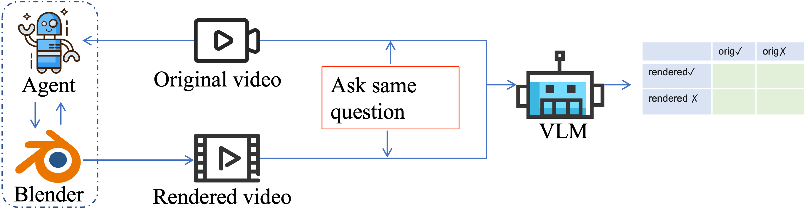

# BVB: Blender-VideoBench

  

**BVB (Blender-VideoBench)** is a benchmark for evaluating fine-grained video understanding through programmatic reconstruction. Instead of relying solely on QA accuracy, which is a necessary but insufficient measure of understanding, BVB asks an agent to generate Blender Python code that reconstructs the 3D scene depicted in a video. Because code is precise, structured, executable, and verifiable, a successful reconstruction provides a *computational proof* of understanding.

This repository hosts the dataset and refinement tooling for BVB.

> Please join our [Discord channel](https://discord.gg/n86Zycpz)!

> *If an agent truly understands a video, it can reconstruct it programmatically.*

## Motivation

Existing video LLMs are typically evaluated on multiple choice or open ended QA. But QA accuracy can mask shallow understanding: a model might pick the right answer for the wrong reason, or memorize dataset biases. BVB takes a fundamentally different view of evaluation:

- **Vision** is raw and unstructured.
- **Language** is descriptive but ambiguous.
- **Code** is precise, structured, executable, and *verifiable*.

If an agent can write Blender Python that, when executed, produces a scene matching the original video on the relevant geometric and spatial properties, that is much stronger evidence of understanding than picking option (C) on a multiple choice question.

## Pipeline

The benchmark supports two complementary uses:

1. **Evaluation** *(near-term focus)*: measure how well scene reconstruction agents (e.g., BlenderMCP-style systems and future methods) reconstruct scenes from video.
2. **Enhancement** *(medium-term direction)*: use code execution feedback (executes? renders correctly? preserves QA-relevant info?) as a reward signal for RL training (e.g., GRPO).

## Why Blender?

Blender is a universal 3D playground covering modeling, animation, rendering, and simulation, with a full Python API and a permissive open source license. It has a high learning curve for humans, which is precisely what makes agent mastery of it valuable.

## Data

The source videos come from **VSI-Bench** ([Visual Spatial Intelligence Benchmark](https://vision-x-nyu.github.io/thinking-in-space.github.io/)), real indoor 3D scenes from ArkitScenes, ScanNet, and ScanNet++ with spatial reasoning QA pairs. VSI-Bench is not committed to this repo and should be cloned locally.

Each finished BVB data point is a tuple of:

- the original video (from VSI-Bench)
- the spatial reasoning QA pairs
- the human refined `.blend` scene
- (eventually) the exported Python script that reconstructs the scene

The data pipeline combines automated reconstruction with human in the loop refinement:

1. Take a VSI-Bench video and its QA pairs.
2. Extract representative frames.
3. Use an agent (Cursor + [BlenderMCP](https://github.com/ahujasid/blender-mcp)) to auto build a first pass Blender scene.
4. **Human refines** the scene in Blender so it preserves the information needed to answer the QA correctly. This is the main contribution of this repo at present.
5. Export the scene to Python via the custom [Blender Export BPY add-on](addons/README.md); the script can re-import the scene end to end.

External asset libraries (PolyHaven, Sketchfab, etc.) are **disallowed** for benchmark agents. All geometry must be constructed from scratch, so the benchmark measures genuine scene understanding rather than asset retrieval skill.

**Paired Modality Editing (PME)** applies parallel edits to the video (via video to video editing / inpainting) and the Blender scene (via keyframe animation) to produce event aligned pairs that test dynamic and temporal understanding without cross modal generation artifacts.

## Evaluation

The vision-level evaluation runs the same question through a frozen VLM on both the original and the agent-reconstructed video, then crosses the two outcomes into a 2x2 contingency table from which retention and hallucination rates are computed.

BVB uses dual level evaluation:

| Level | Metric | What it measures |
|------|--------|-------------------|
| Vision | **Retention rate** = `#(orig ✓ ∧ rendered ✓) / #(orig ✓)` | How much correct info the reconstruction preserves |
| Vision | **Hallucination rate** = `#(orig ✗ ∧ rendered ✓) / #(orig ✗)` | How much incorrect info the reconstruction introduces |
| Vision | **Δ accuracy** | Difference between QA accuracy on original vs. rendered video |
| Code | **Semantic edit distance** | LLM judged structural difference between GT code and agent code |
| Code | **Executability** | Code that fails to run scores 0, which is a natural sanity check |

## Benchmark comparison

| Benchmark | Date | # Samples | Video Input | Beyond Simple QA | 3D Scene | Blender Environment | Evaluation | Position vs. BVB |
|---|---:|---:|:---:|:---:|:---:|:---:|---|---|
| ScreenSpot-Pro | 04/25 | 1,581 screenshot-instruction pairs |  | ✓ |  |  | GUI grounding accuracy | Professional 2D GUI grounding; no video or 3D reconstruction. |
| VSI-Bench | 12/24 | 288 real videos | ✓ |  |  |  | MCA accuracy and MRA for numerical answers | Spatial video QA benchmark; BVB adds executable 3D reconstruction. |
| GUI-Xplore | 03/25 | 312 apps | ✓ | ✓ |  |  | Five downstream QA tasks plus cross-app automation metrics | Uses exploration videos as GUI priors, but remains a 2D interface benchmark. |
| VideoGUI | 06/24 | 178 GUI tasks | ✓ | ✓ |  |  | High-level planning, mid-level planning, atomic action metrics | Evaluates video-based GUI automation rather than physical scene reconstruction. |
| VideoWebArena | 10/24 | 74 tutorial videos | ✓ | ✓ |  |  | Task success and factual QA accuracy | Evaluates video-conditioned web agents; BVB evaluates video-conditioned 3D reconstruction. |
| OmniLottie / MMLottieBench | 03/26 | 900 benchmark samples | ✓ | ✓ |  |  | Animation generation quality across text2lottie, text-image2lottie, video2lottie | Produces executable vector animation programs, but not 3D scene reconstructions. |
| BlenderGym | 04/25 | 245 start-goal scene pairs |  | ✓ | ✓ | ✓ | Code-based 3D reconstruction/editing metrics | Closest graphics benchmark, but focuses on start-to-goal editing rather than reconstructing from video. |
| BlenderBench | 01/26 | 30 tasks |  | ✓ | ✓ | ✓ | Photometric loss and VLM score | Tests inverse-graphics agent loops; BVB turns video understanding itself into the reconstruction target. |
| Code-as-Room | 05/26 | 41 scenes |  | ✓ | ✓ | ✓ | Object recall, spatial/layout metrics, execution rate, VLM/human scene quality | Most similar in code-as-scene representation, but input is top-down image rather than egocentric video. |
| EZBlender | 01/26 | 85 episodes across five dimensions |  | ✓ | ✓ | ✓ | Task completion rate, CLIP alignment, latency, token cost | Benchmarks efficient Blender scene editing, not video understanding. |
| VisPhyWorld / VisPhyBench | 02/26 | 209 videos from 108 physical templates | ✓ | ✓ | ✓ |  | Validity, perceptual quality, semantic consistency, motion/physics metrics | Execution-based reconstruction benchmark for physics simulators rather than Blender indoor scenes. |
| **BVB (ours)** | **05/26** | **300-500 planned scene/video samples** | **✓** | **✓** | **✓** | **✓** | **Video-level retention, hallucination, code executability, semantic code comparison** | **Video understanding is evaluated by reconstructing the 3D scene as executable Blender code.** |

## Contributing scene refinements

The `.blend` files in this repo are an automated first pass and need human cleanup so that an evaluation model can answer the corresponding QA item correctly using only the reconstructed scene. See [refinement_guidance.md](refinement_guidance.md) for the full workflow, including how to set up Blender and VSI-Bench, claim a scene, run `refine.sh`, edit the scene, and push the result.

## Status

Active development. About 450 VSI-Bench scenes are currently tracked, with Blender reconstructions in progress. Dataset, evaluation framework, and baseline numbers for reconstruction agents are targeted for release alongside the BVB paper.

## License

See [LICENSE](LICENSE).
