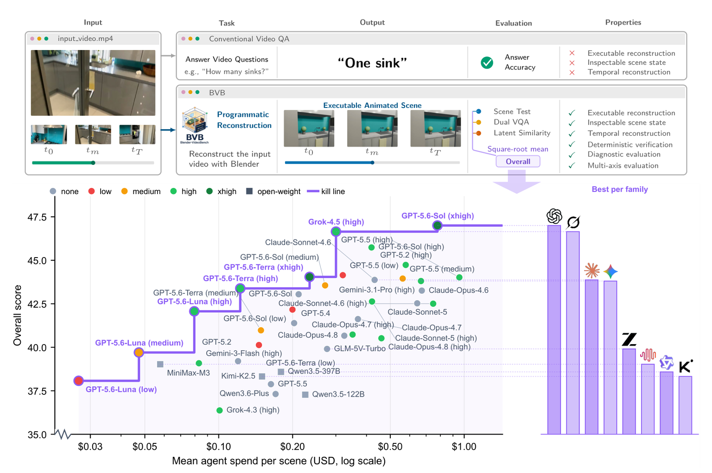
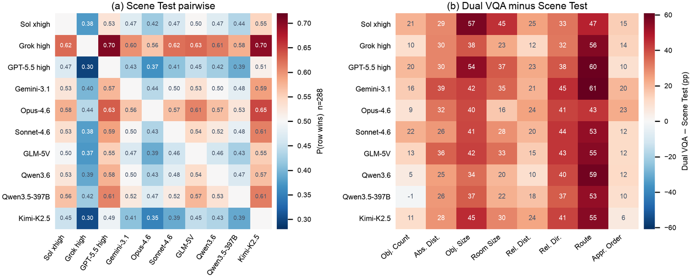

<p align="center">
  
</p>

<h1 align="center">BVB: Blender-VideoBench</h1>

<p align="center">
  <strong>Benchmarking Video Understanding via Programmatic Reconstruction</strong>
</p>

<p align="center">
  <a href="https://yoloytang.me/BVB/"></a>
  <a href="https://yoloytang.me/BVB/paper.pdf"></a>
  <a href="https://discord.gg/n86Zycpz"></a>
  <a href="LICENSE"></a>
</p>

> **If an agent truly understands a video, it should be able to reconstruct it as an executable program.**

Most video benchmarks ask a model to select or generate an answer. BVB asks an
agent to rebuild the video itself. Given a real indoor video, the agent writes
Blender Python that reconstructs the scene, its metric relations, the camera
trajectory, and the order in which content appears. The resulting `.blend` is
executable, inspectable, and mechanically testable: a computational proof of
what the agent understood.

<p align="center">
  <a href="https://yoloytang.me/BVB/">
    
  </a>
</p>

## At a glance

- **288 real indoor videos** from the held-out VSI-Bench test split, sourced
  from ARKitScenes, ScanNet, and ScanNet++.
- **43 agent configurations across nine model families**, evaluated under one
  shared sandbox and prompt contract.
- **Three complementary axes**: deterministic scene tests, paired video-QA
  retention, and frozen video-embedding similarity.
- **No external asset libraries**. Agents construct geometry from Blender
  primitives and operators instead of retrieving meshes.
- **Animated, executable output**. The target is a Blender program and scene,
  not a caption, a single image, or a static snapshot.

The full interactive results are on the
[project page](https://yoloytang.me/BVB/#leaderboard). This README intentionally
focuses on the benchmark and reproducible workflow rather than duplicating the
leaderboard.

## Why programmatic reconstruction?

Question answering is useful, but a correct answer does not guarantee a
coherent scene model. Reconstruction forces an agent to commit to compatible
claims about objects, scale, distance, direction, viewpoint, and time.

- **Vision is raw.** Pixels do not explicitly state which scene generated them.
- **Language is ambiguous.** Many incompatible scenes fit the same description.
- **Code is falsifiable.** It can be executed, introspected, rendered, and tested.

## Benchmark protocol

<p align="center">
  
</p>

1. **Reconstruct.** A cost-limited agent receives only `bash` and `frames`
   inside a fresh Blender 4.2 Docker sandbox. It inspects the source video and
   writes an animated `result.blend`.
2. **Evaluate.** Scoring is fully decoupled from the agent loop. The submission
   is introspected for deterministic tests, rendered for paired video QA, and
   encoded by a frozen video model.

### Evaluation axes

| Axis | Signal | What it checks |
|---|---|---|
| **Scene Test (ST)** | Deterministic unit-test pass rate | Assets, metric relations, camera trajectory, and appearance order in the introspected scene state |
| **Dual VQA (DV)** | Original-correct answer retention | Whether the reconstruction preserves question-answerable content from the source video |
| **Latent Similarity (LS)** | Frozen V-JEPA 2.1 similarity | Layout and motion agreement between the source clip and rendered reconstruction |

The language model used during Scene Test only grounds semantic references such
as “the chair” to scene-object groups. It never decides whether a test passes.
Host-side deterministic functions compute every pass or failure.

## What current agents reveal

- The strongest configuration passes only **21.5%** of Scene Test checks.
- Relations top out at **17.0%**, while the best Trajectory score is just
  **4.2%**. No configuration exceeds **3.3%** on appearance order.
- Among ten representative systems, Scene Test and Dual VQA rankings are
  nearly uncorrelated (Pearson *r* = 0.18, Spearman ρ = 0.14).
- A 36-fold spread in agent spend still leaves **36 of 43** configurations
  beaten by a cheaper alternative.

In short, a reconstruction can look right without being right. Perceptual
metrics often reward plausible renders whose underlying scenes fail executable
checks.

<p align="center">
  
</p>

## Run the benchmark

### 1. Prepare the source videos

BVB uses the real indoor clips from
[VSI-Bench](https://vision-x-nyu.github.io/thinking-in-space.github.io/).
They are not redistributed in this repository. Clone VSI-Bench locally at
`VSI-Bench/` before running the complete benchmark.

### 2. Build the Stage-1 sandbox

Prerequisites are Python 3.10+, Docker, and `ffmpeg`/`ffprobe`.

```bash
cd sandbox
docker build -t bvb-sandbox:latest .
python3 -m venv .venv
.venv/bin/pip install -r requirements.txt
```

### 3. Reconstruct a smoke-test subset

```bash
export OPENAI_API_KEY="..."  # or the key required by your provider

.venv/bin/python run_agent.py \
  --model gpt-5.5 \
  --output results/run_001 \
  --cost-limit 3.0 \
  --limit 5
```

Remove `--limit` to run all 288 scenes. Use `--resume` for interruption-safe
batches. See [`sandbox/README.md`](sandbox/README.md) for the full harness
contract and provider options.

### 4. Run executable Scene Test scoring

```bash
export BLENDER_BIN="/path/to/blender"
export OPENAI_API_KEY="..."

python ../eval/unit_test_metric.py \
  --run results/run_001 \
  --mode execute \
  --model gpt-5.4-mini \
  --cache-dir results/run_001/introspection-cache \
  --resume
```

Dual VQA and V-JEPA scoring instructions, including the Mac-to-GPU handoff for
camera renders, are documented in [`eval/README.md`](eval/README.md).

## Restore released run artifacts

Large Stage-1 artifacts are kept outside GitHub in the Hugging Face dataset
repository `yunlong10/BVB-results`. Access is required.

```bash
pip install -U huggingface_hub hf_transfer
hf auth login
HF_HUB_ENABLE_HF_TRANSFER=1 python scripts/download_results.py
```

To restore one run:

```bash
HF_HUB_ENABLE_HF_TRANSFER=1 python scripts/download_results.py \
  --run mini-harness-gpt-5.6-sol-reasoning-high-run01
```

## Repository guide

- [`sandbox/`](sandbox/README.md): Stage-1 agent harness and Blender Docker sandbox.
- [`eval/`](eval/README.md): Scene Test, Dual VQA, and V-JEPA evaluation.
- [`blend/`](blend/): human-refined Blender reference scenes.
- [`bpy/`](bpy/): exported Blender Python reconstructions.
- [`addons/`](addons/README.md): Blender-to-Python export add-on.
- [`refinement_guidance.md`](refinement_guidance.md): scene-refinement workflow.

## Contributing

Reference-scene refinement is still active. Please read
[`refinement_guidance.md`](refinement_guidance.md) before claiming a scene.
Cursor users can also follow the repository's BVB scene-builder skill at
`.cursor/skills/bvb-scene-builder/SKILL.md`.

## Paper and license

Read the [BVB paper](https://yoloytang.me/BVB/paper.pdf) for the complete
benchmark definition, 43-configuration study, analysis, and human validation.

BVB is released under the [MIT License](LICENSE).
