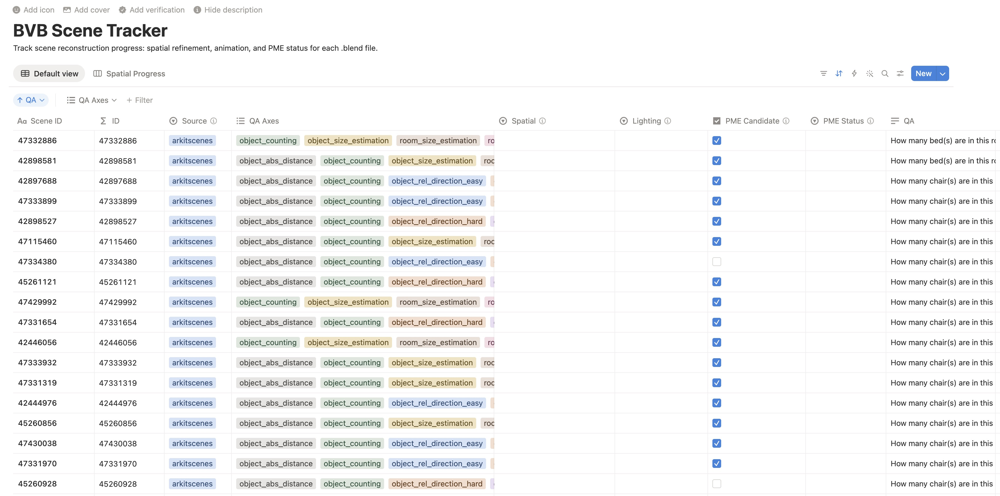

# Blender Scene Refinement Guide

This guide is for refining the generated Blender scenes in the BVB repository. The goal is to adjust each `.blend` file so that an evaluation model can answer the corresponding QA item correctly after looking at the refined scene.

> Please join our [Discord channel](https://discord.gg/n86Zycpz)!

## 1. Set Up Blender

Install the latest version of Blender from the official Blender website:

https://www.blender.org/download/

Before starting refinement, spend some time getting comfortable with the basic object manipulation controls in Blender:

- Move objects along the X, Y, and Z axes.
- Rotate objects around the X, Y, and Z axes.
- Scale objects along the X, Y, and Z axes.
- Use Blender's transform controls and numeric axis inputs when precise adjustments are needed.

You do not need advanced Blender modeling skills for this task. The most important operations are moving, rotating, and scaling objects so that the scene better matches the source video.

Tip: BlenderMCP is optional. Manual refinement is recommended because it is usually more stable and gives you better control over the final scene. If you are already comfortable using BlenderMCP, you can connect Blender to Claude or Cursor and ask the agent to help inspect or adjust the scene, but always verify the result manually in Blender before saving.

To use BlenderMCP as optional assistance:

1. Install and enable the BlenderMCP add-on in Blender.
2. Start the BlenderMCP server from inside Blender.
3. Connect Claude or Cursor to that MCP server using your local MCP configuration.
4. Test the connection with a simple scene-inspection request before making edits.
5. Use the agent only as an assistant; the final refinement decision should still be made manually by comparing the Blender scene with the source video and the QA item.

## 2. Clone the Repositories

Clone the BVB repository first:

```bash
git clone https://github.com/yunlong10/BVB.git
cd BVB
```

Then clone the VSI-Bench dataset inside the `BVB` directory:

```bash
git clone https://huggingface.co/datasets/nyu-visionx/VSI-Bench
```

After this step, the directory should contain both the BVB files and a local `VSI-Bench` folder.

## 3. Pick a Scene ID

Open the refinement tracking table:

https://www.notion.so/365a82bfca1280ba8fb8fcc14bf63315?v=365a82bfca128135b7cd000c6ba95f6e&source=copy_link

Choose an ID that has not been refined yet. Copy that ID exactly as it appears in the table.



## 4. Start Refinement

From the `BVB` repository root, start refinement:

```bash
./refine.sh [id]
```

Replace `[id]` with the scene ID you copied from Notion.

The script will automatically:

- Open `blend/[id].blend` in Blender.
- Open the matching source video from `VSI-Bench/{arkitscenes|scannet|scannetpp}/[id].mp4`.

Use the source video as the reference while editing the Blender scene.

## 5. Refinement Standard

For each scene, refine the Blender file with the corresponding QA item in mind. The standard is:

The refined scene should make it as easy as possible for the evaluation model to answer the QA question in the Notion table correctly.

Focus on changes that matter for the question. For example, if the QA item depends on object position, visibility, orientation, distance, or relative layout, adjust those parts of the scene carefully. The scene does not need to be visually perfect, but it should preserve the information needed to answer the QA correctly.

## 6. Save and Push

After finishing the refinement:

1. Save the `.blend` file in Blender.
2. Pull the latest changes:

```bash
git pull
```

3. Stage the refined Blender files. You can submit one scene or several scenes at once:

```bash
git add blend/[id].blend
# or, after refining multiple scenes:
git add blend/*.blend
```

4. Commit and push:

```bash
git commit -m "Refine Blender scenes"
git push
```

## 7. Update the Tracking Table

After the push succeeds, go back to the Notion table and write your name in the `Refiner` column for that ID.

Then pick another unrefined ID and repeat the same process.
